# Eclipse Modeling Framework - EMF

This tutorial is an introduction to EMF and explains the basics of EMF. We start by showing you how to build a very simple data-centric application, including the UI, based on EMF. We explain how to define a model in EMF and generate code from it. We explore the API of the generated code, that is, how to create, navigate and modify model instances.

# Introduction

To answer the question, “What is EMF?”, we’ll borrow the description from the EMF website:

“The EMF project is a modeling framework and code generation facility for building tools and other applications based on a structured data model. From a model specification described in XMI, EMF provides tools and runtime support to produce a set of Java classes for the model, along with a set of adapter classes that enable viewing and command-based editing of the model, and a basic editor.”

Source: https://www.eclipse.org/em

It is worth mentioning that in addition to being a successful modeling framework, EMF has also been a stable standard for many other modeling technologies. We recommend using EMF for any structured data model you want to create in Eclipse, especially if it is stored, displayed and modified in UIs.

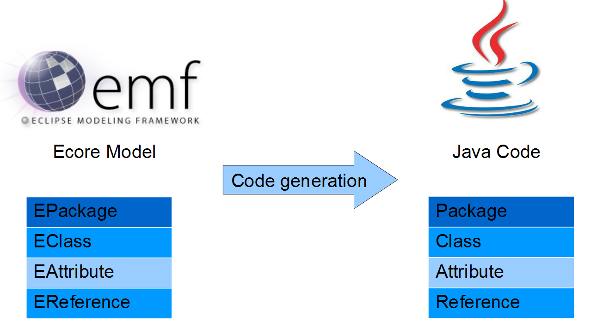

The basic EMF workflow is very pragmatic; a model is created and defined in the Ecore format, which is basically a subset of UML Class diagrams. From an Ecore model, you can generate Java code.

Later in this tutorial we will have two running instances of Eclipse. In the first instance, called the “IDE”, we will define the model and generate code from it. The second instance, called the “Runtime”, will be started from the IDE and will contain instances of the generated model.

# Example Model

①创建Ecore建模项目

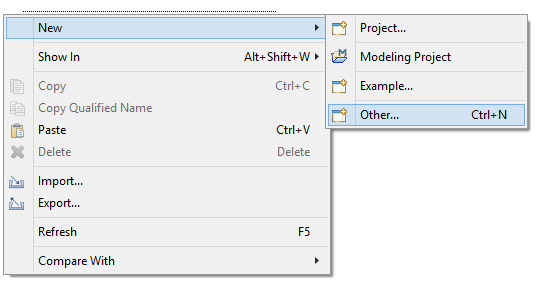

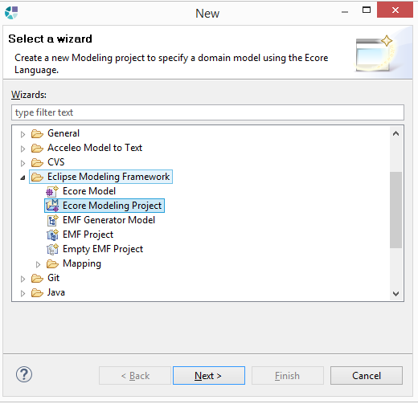

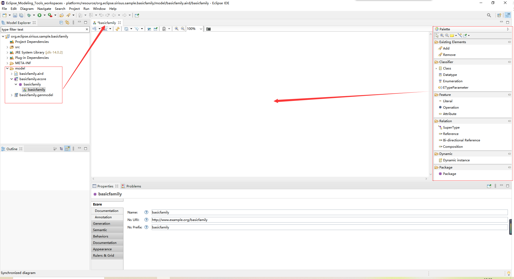

## ②添加元素创建元模型

**a.使用工具栏中的“class”工具创建*Family，Person，Man和Woman*。使用属性视图将Person设置为*abstract*。**

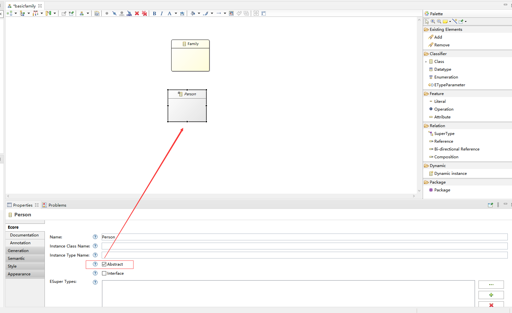

**b.使用工具栏或弹出窗口中的“属性”工具在Family和Person上创建一个名为*name*的属性。**

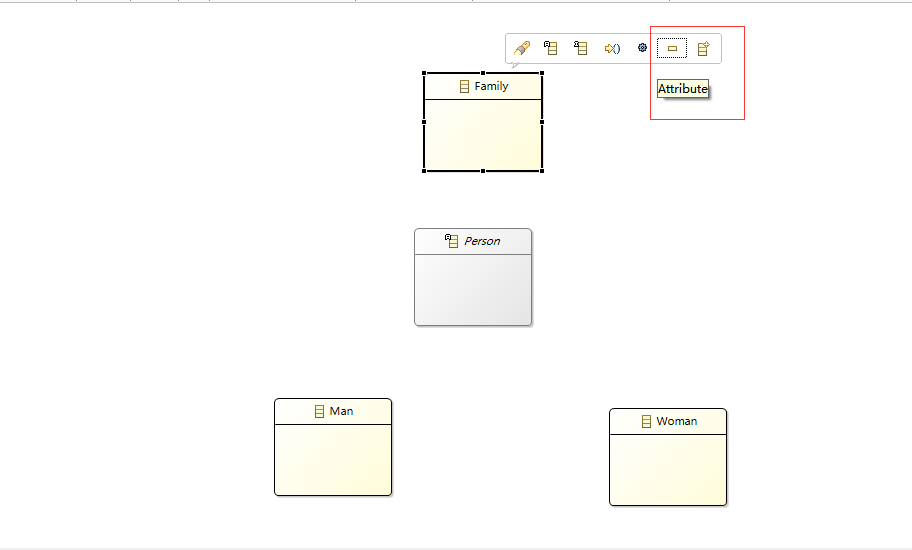

## ③使用工具栏添加关系

**a.使用工具栏中的“Composition”工具在“Family”和“Person”之间创建一个名为“*person”*的**Composition关系。**

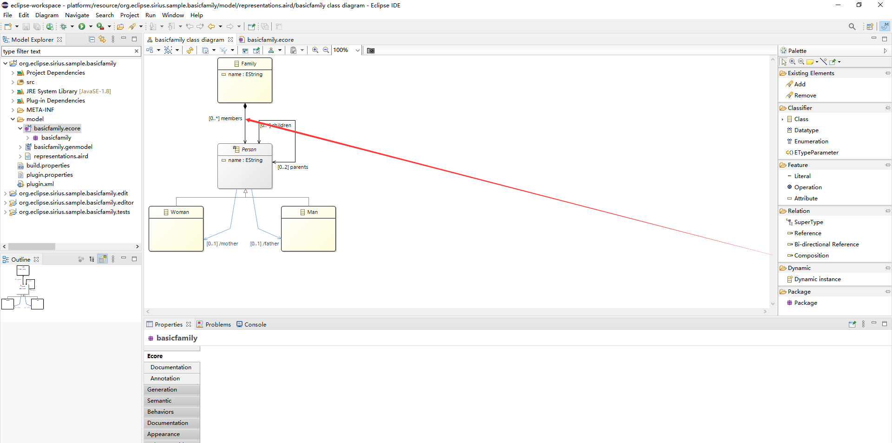

  **b.使用Bi-directionalReference工具创建的关系命名为*儿童*和*家长*从人到人：**

  **c.使用工具栏中的SuperType工具创建从Man和Woman到Person的继承关系：**

**d.使用工具栏Reference工具创建从“人”到“男人和女人”的两个名为“*父亲”*和“*母亲”的*关系。在“属性”视图中检查这些引用的*派生*属性**

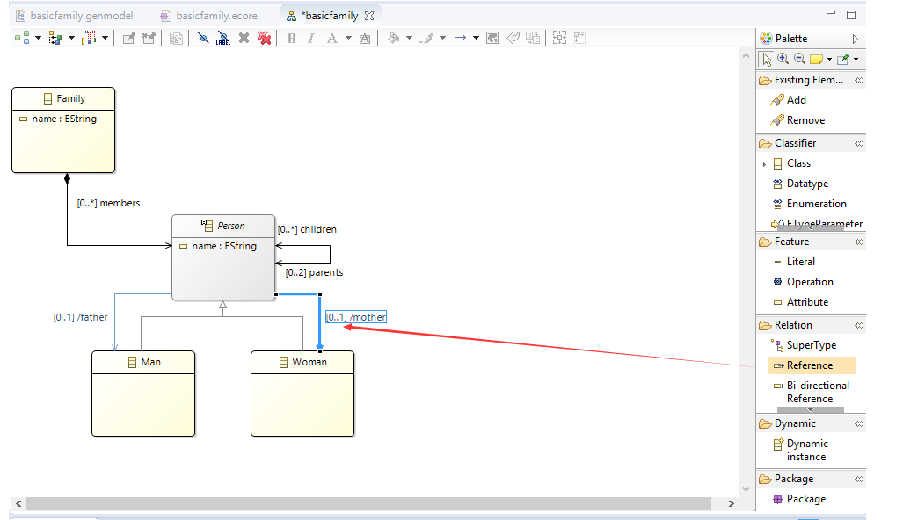

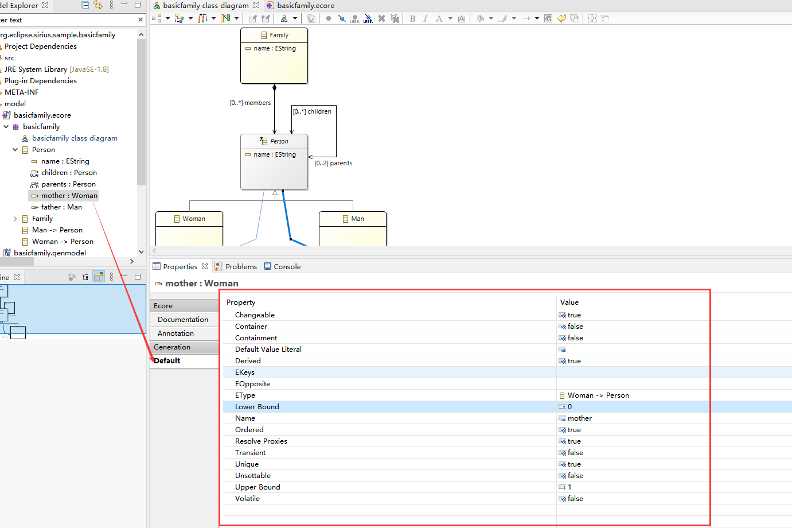

## ④生成元模型的源代码

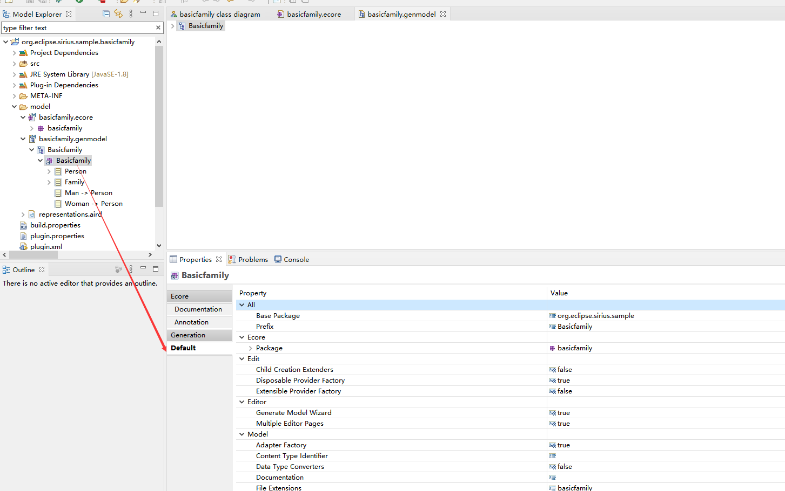

**右键单击类图，然后选择Generate> All**

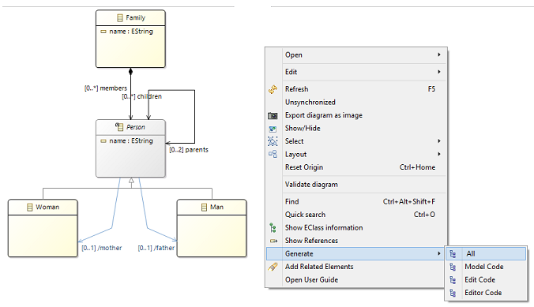

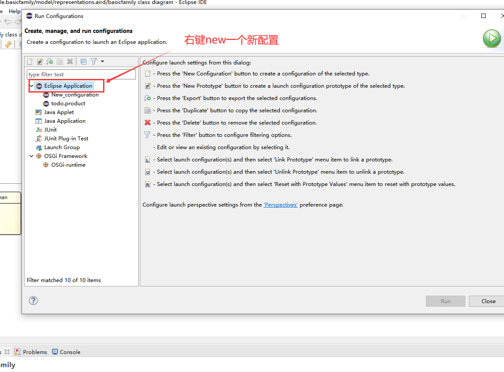

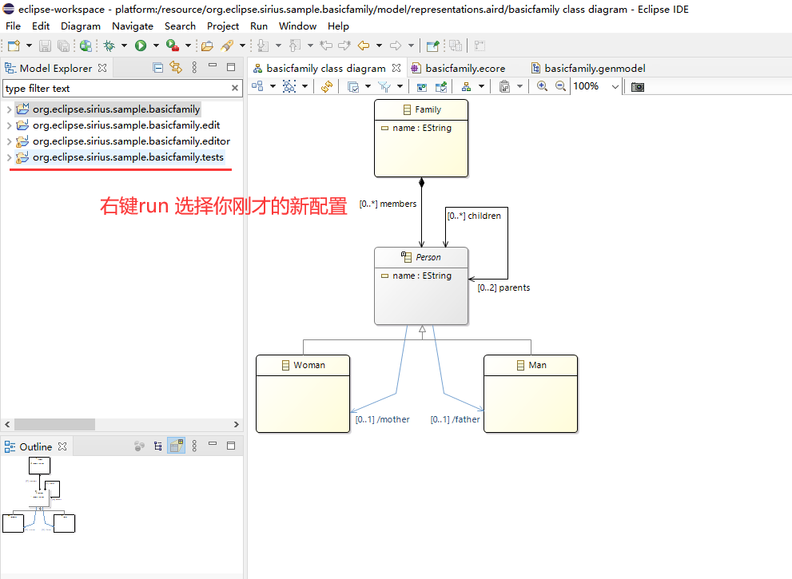

## ⑤创建一个新的建模项目

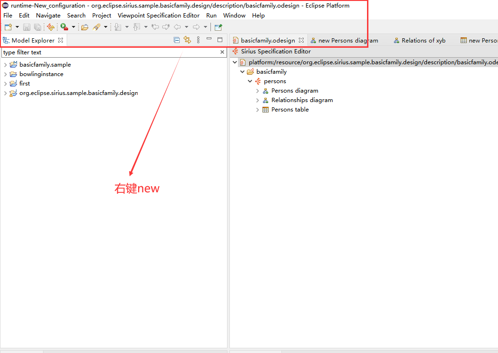

**在创建的新项目上，右键单击“*新建”>“其他...**

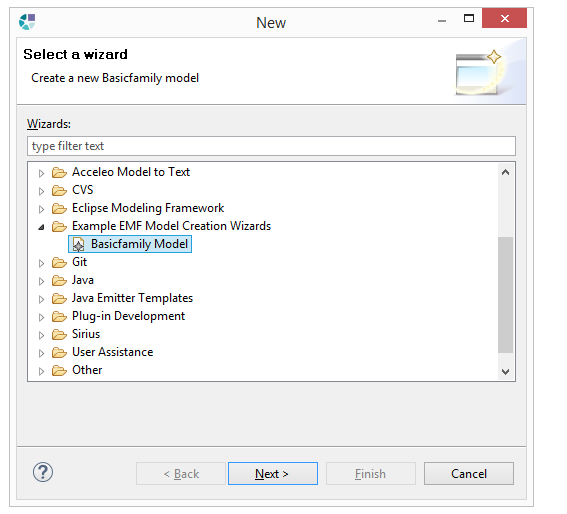

**EMF创建了一个新模型，并自动打开了默认的树编辑器。**
**要将元素添加到该模型，请右键单击“*家庭”*元素，然后选择“*男人”*或“*女人”*菜单**

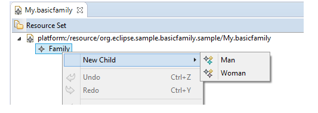

**使用属性视图，您可以编辑人员的姓名，并将其“*父级”*或“*子级”*关系设置为模型中的其他人员。**

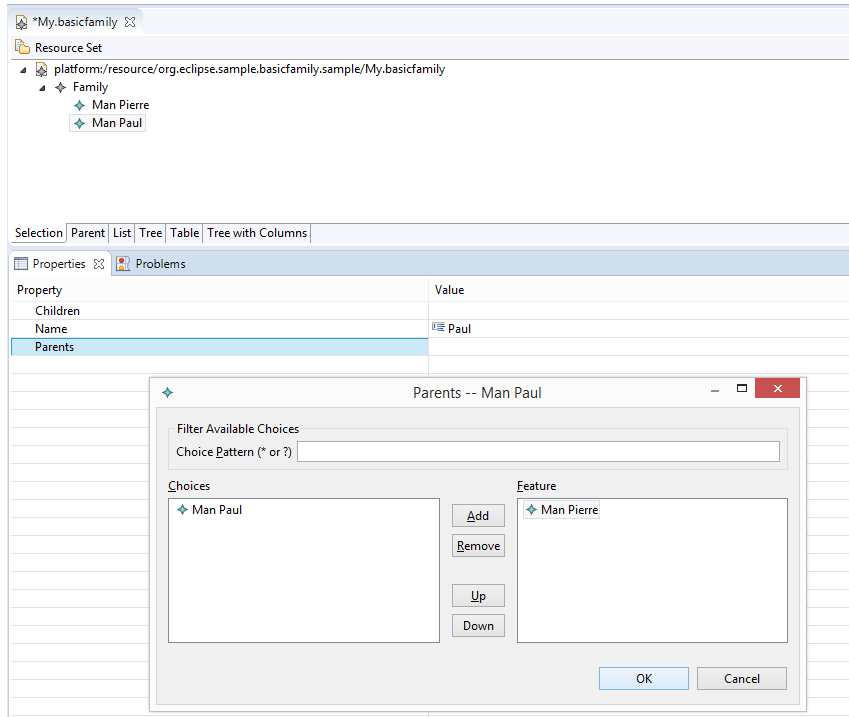

## ⑥更改默认的EMF图标

**注意：**如您所见，树中的*Basicfamily Model*工具具有默认的EMF图标（空白文件上带有星号）。

要更改此图标，只需将*/org.eclipse.sirius.sample.basicfamily.editor/icons/full/obj16/*中的*BasicfamilyModelFile.gif*替换为您自己的特定图标即可：

注意：男人，女人和家庭的图标在*/org.eclipse.sirius.sample.basicfamily.edit/icons/full/obj16*中定义。

我们已替换了EMF生成的默认值：

要使元素创建（男人或女人）具有相同的图标，应修改basicfamily.genmodel。

将其打开，在属性视图中，将“*创建图标”*值更新为`false`

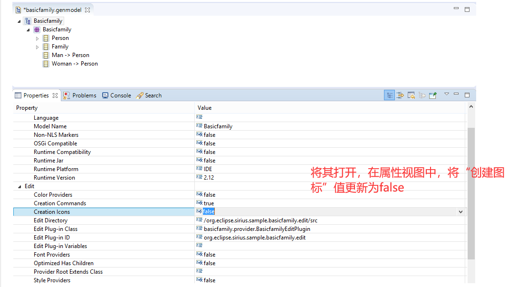

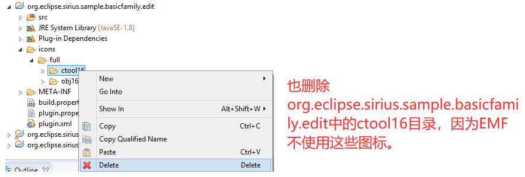

右键单击BasicFamily根模型，然后选择“**生成编辑代码”**

单击选项卡中的重新启动运行时。您将在新的*Basicfamily模型*创建向导中看到此新图标：
